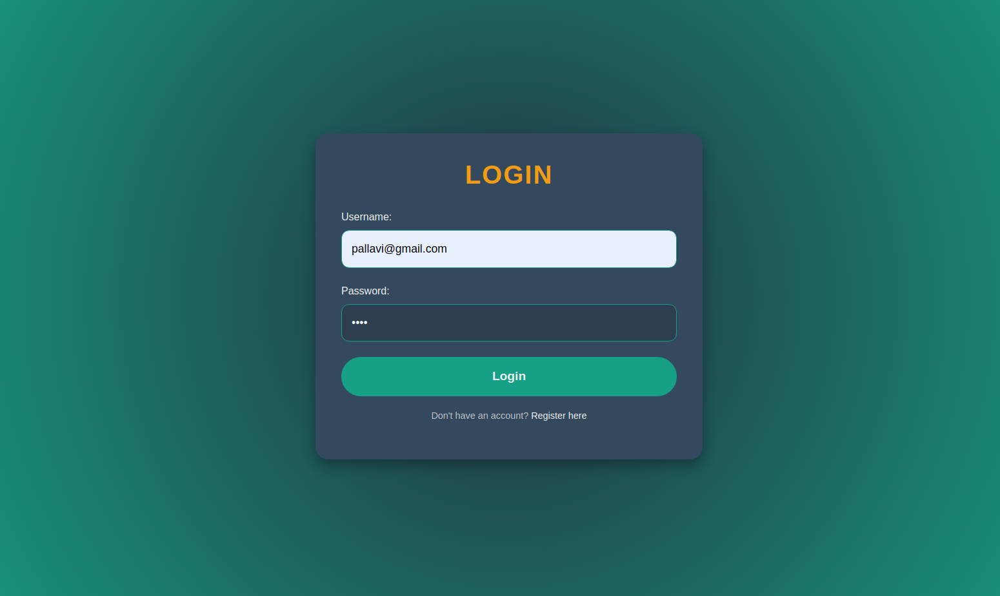
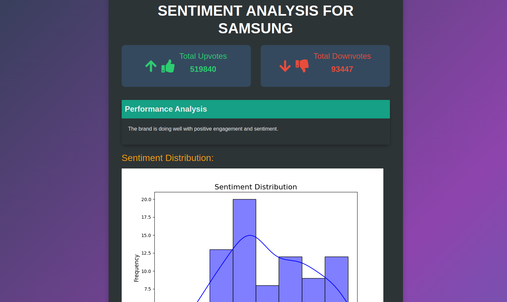

---

# BrandSentio - Reddit Sentiment Analysis

## Overview
BrandSentio is a Flask-based web application designed to analyze the sentiment of Reddit posts and news articles for specific brands or keywords. It leverages the **Reddit API**, **News API**, and **VADER Sentiment Analyzer** to provide actionable insights into user sentiment and engagement. This tool is ideal for brands to monitor their online reputation and make data-driven decisions.

This project was built as part of a hackathon, showcasing a quick yet effective solution for sentiment analysis and brand performance evaluation.

---

## Features
- **Real-time Reddit Data**: Fetch posts from Reddit using the PRAW API.
- **News Article Analysis**: Fetch and analyze news articles using the News API.
- **Sentiment Analysis**: Analyze user sentiment with the VADER SentimentIntensityAnalyzer.
- **Visualizations**:
  - Sentiment distribution histogram.
  - Upvotes vs. downvotes pie chart.
- **Brand Performance Score**: A unique metric combining sentiment, upvotes, and downvotes to assess brand reputation.
- **Detailed Post Analysis**: View individual Reddit posts and news articles with sentiment scores.
- **User Authentication**: Secure login and registration system for users.

---

## Tech Stack
- **Backend**: Python, Flask
- **Data Processing**: Pandas, Matplotlib, Seaborn
- **API Integration**: 
  - PRAW (Python Reddit API Wrapper)
  - News API
- **Sentiment Analysis**: VADER (Valence Aware Dictionary and sEntiment Reasoner)
- **Visualization**: Matplotlib, Seaborn
- **Frontend**: HTML, CSS, Bootstrap

---

## Live Demo
The application is deployed and accessible here:  
👉 [BrandSentio Live Demo](https://tech-titans-vodr.onrender.com/)

---

Here is the Demo Video of the Prototype:
👉[Prototype Demo Video](https://drive.google.com/file/d/1d2z7Uy25OaqupUpgaysxD51umTWx3AG7/view?usp=sharing)

---

## Requirements

### Prerequisites
- Python 3.7 or above
- Reddit API credentials:
  - Client ID
  - Client Secret
  - User Agent
- News API key

### Install Dependencies
Run the following command to install the necessary Python libraries:
```bash
pip install -r requirements.txt
```

---

## Setup Instructions

1. Clone the repository:
   ```bash
   git clone https://github.com/Pallavi-Pandey/Tech_Titans.git
   cd Tech_Titans
   ```

2. Configure your API credentials:
   - Edit the `reddit` configuration in `app.py`:
     ```python
     reddit = praw.Reddit(
         client_id='your_client_id',
         client_secret='your_client_secret',
         user_agent='your_user_agent'
     )
     ```
   - Add your News API key in `app.py`:
     ```python
     news_api_key = 'your_news_api_key'
     ```

3. Create the directory for storing plots:
   ```bash
   mkdir -p static/plots
   ```

4. Run the application:
   ```bash
   python app.py
   ```

5. Open your browser and navigate to:
   ```
   http://127.0.0.1:5000/
   ```

---

## Usage
1. **Register** or **Login** to access the application.
2. Enter a brand name or keyword in the input form on the homepage.
3. Click "Analyze" to fetch and analyze related Reddit posts and news articles.
4. View:
   - Sentiment distribution plot.
   - Upvotes vs. downvotes pie chart.
   - Brand performance score and interpretation.
   - Detailed analysis of individual posts and articles.

---

## Example Output
- **Sentiment Distribution Plot**: Visualizes sentiment scores across analyzed posts and articles.
- **Upvotes vs. Downvotes Pie Chart**: Displays the ratio of upvotes to downvotes for Reddit posts.
- **Brand Performance Score**: A concise metric reflecting brand sentiment and engagement.

---

## Hackathon Notes
- **Goal**: Build a tool that provides quick insights into brand perception using publicly available data.
- **Timeframe**: Developed within the limited timeframe of the hackathon.
- **Team Contribution**: Collaboratively built with a focus on sentiment analysis and data visualization.

---

## Future Work
- Expand support to other social media platforms (e.g., Twitter, Facebook).
- Add time-series analysis for tracking sentiment trends over time.
- Integrate machine learning for advanced sentiment analysis and topic modeling.
- Enhance user interface with interactive dashboards.

---

## License
This project is open-source and available under the MIT License.

---

## Screenshots

*Login Page*


*Analysis Results*

---

We hope you enjoy using BrandSentio! Feedback and contributions are welcome.

---

### How to Contribute
1. Fork the repository.
2. Create a new branch for your feature or bugfix.
3. Submit a pull request with a detailed description of your changes.

---
